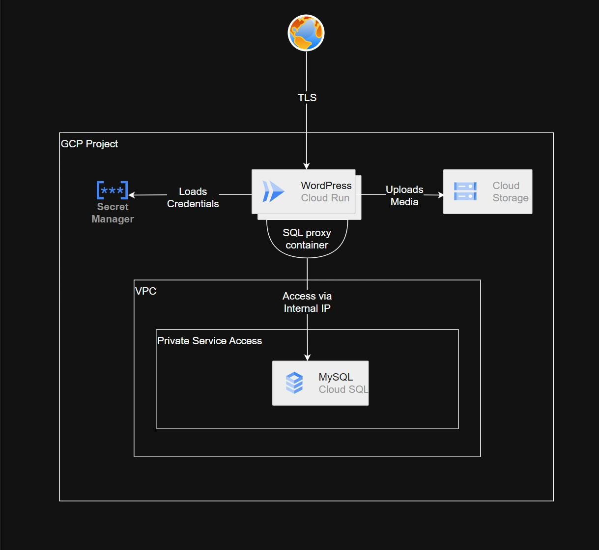

# WordPress on GCP Cloud Run
Read about the intention behind this repo [here](https://www.linkedin.com/pulse/how-i-deployed-wordpress-gcp-cloud-run-30-60-cheaper-than-tohid-azimi-bws8c/)

**Production-ready WordPress hosting for $36/month. Own your infrastructure, not rent it.**

Deploy a scalable, secure WordPress site on Google Cloud Platform in minutes. No vendor lock-in, full infrastructure control, and costs that scale with your traffic.

---

## Why This vs Managed WordPress?

| Feature | **This Solution** | WP Engine | Kinsta |
|---------|-------------------|-----------|--------|
| **Monthly Cost** as of Oct 2025 | **$36** | $59 | $50 |
| **Free hosting period** | **3 months^** | ❌ | ❌ |
| **Traffic Included** | 75K visits (150K requests) | 75K visits | 65K visits |
| **Auto-scaling** | ✅ 0-5 instances (pay per request) | ❌ Fixed resources | ❌ Fixed resources |
| **Infrastructure Control** | ✅ Full access | ❌ Black box | ❌ Black box |
| **Infrastructure as Code** | ✅ Terraform | ❌ | ❌ |
| **Vendor Lock-in** | ✅ None - you own it | ❌ Locked | ❌ Locked |
| **Custom Architecture** | ✅ Fully customizable | ❌ Limited | ❌ Limited |
| **Database Backups** | ✅ Auto + PITR | ✅ | ✅ |
| **Backups Retention** | 7 days | ? | 14 days |
| **CDN for Media** | ✅ Google Cloud Storage | ✅ | ✅ |
| **One-Click Deploy** | ✅ | ✅ | ✅ |
| **Multi-region** | ✅ 40+ regions | ❌ Limited | ❌ Limited |
| **Multi-sites** |  ❌ | ✅  3 sites  | ❌ |
| **24/7 WordPress technical expertise** |  ❌ |  ✅   | ✅ |


**The Bottom Line:** Save 28-39% on costs. Pay only for traffic you serve, not idle capacity.

---

## 🎬 Deployment Demo

<a href="https://www.youtube.com/watch?v=aevveq0ohw8">
  
</a>

**[▶️ Watch the full deployment (1:20)](https://www.youtube.com/watch?v=aevveq0ohw8)**

See the complete deployment process from a single command to a live WordPress site. Video shows actual deployment trimmed at 3x speed (~20 minutes real-time).

**What you'll see:**
- One command: `./scripts/end-to-end-deploy.sh <PROJECT-ID>`
- Automated infrastructure deployment with Terraform
- WordPress container build and deployment
- Live site in under 20 minutes

---

## 🎁 ^Free for 3 Months!

**New Google Cloud users get $300 in free credits valid for 90 days.**

This means your WordPress hosting is **completely free** for the first 3 months, even if you spend $100/month on resources!

- ✅ **$36/month** × 3 months = **$108 total**
- ✅ You have **$300 in credits**
- ✅ **$192 left over** to experiment with other GCP services

**Even better:** If your site scales up to $50-100/month during testing, you're still covered by the free credits.

👉 [Sign up for Google Cloud](https://cloud.google.com/) and get started today with zero upfront costs!


---

## Features

### Infrastructure
- **Auto-scaling Cloud Run** - Automatically scales from 0 to 5 instances based on traffic (configurable)
- **Private Cloud SQL (MySQL 8.0)** - Secure database with automatic backups and point-in-time recovery
- **Cloud Storage for Media** - Durable object storage with optional CDN
- **Private Networking** - VPC with Cloud NAT for secure, isolated environment
- **Secret Management** - Automated credential generation and secure storage

### Developer Experience
- **Infrastructure as Code** - 100% reproducible deployments via Terraform
- **One-Click Deployment** - Single command deploys entire infrastructure
- **Multi-container Architecture** - WordPress + Cloud SQL Proxy sidecar pattern
- **Modular Design** - Reusable Terraform modules for each component

### Security & Compliance
- **Private Database** - No public IP, accessed via Cloud SQL Proxy
- **Automated Secrets** - Random password generation for DB and WordPress admin
- **Resource-level IAM** - Principle of least privilege access
- **EU Data Residency** - GDPR-compliant secret replication (Premium)

---

## Cost Breakdown

### Tiny Profile (Starter Sites)
*Based on actual Google Cloud pricing as of October 2025 in _us-central1_ region*

| Service | Details | Monthly Cost |
|---------|---------|--------------|
| **Cloud Run** | 1 vCPU, 512MB RAM (1-sec avg response) | $9.54 |
| **Cloud SQL MySQL** | db-f1-micro (0.6GB RAM) | $10.17 |
| **Cloud Storage** | 10GB media storage | $0.60 |
| **Artifact Registry** | 10GB container images | $0.95 |
| **Secret Manager** | 3 secrets | $0.00 |
| **Networking** | VPC, Cloud NAT | Included in Cloud Run |
| **TOTAL** | | **$21.25/month** |

**What you get for $21/month:**
- 100,000 requests/month (Cloud Run free tier)
- Automatic scaling from 0 to 3 instances
- Automated daily backups with 7-day retention
- 10GB media storage
- Private, secure database
- SSL/TLS certificates (via Cloud Run)

**Cost scales with usage:**
- Pay only for actual compute time (request-based billing)
- No charge when site has zero traffic
- Additional requests: $0.40 per million

---

### Small Profile (Growing Sites)
*Based on actual Google Cloud pricing as of October 2025 in _us-central1_ region*

| Service | Details | Monthly Cost |
|---------|---------|--------------|
| **Cloud Run** | 2 vCPU, 2GB RAM (3-sec avg response) | $24.00 |
| **Cloud SQL MySQL** | db-f1-micro (0.6GB RAM) | $10.17 |
| **Cloud Storage** | 10GB media storage | $0.60 |
| **Artifact Registry** | 10GB container images | $0.95 |
| **Secret Manager** | 3 secrets | $0.00 |
| **Networking** | VPC, Cloud NAT | Included in Cloud Run |
| **TOTAL** | | **$35.72/month** |

**What you get for $36/month:**
- 75,000 visits/month (150,000 requests)
- 2x CPU and 4x memory vs Tiny tier
- Automatic scaling from 0 to 5 instances
- Automated daily backups with 7-day retention
- 10GB media storage
- Private, secure database
- SSL/TLS certificates (via Cloud Run)

**Performance improvements:**
- Faster page loads with 2 vCPU
- Better handling of traffic spikes
- Improved plugin performance with 2GB RAM
- Suitable for sites with 75K+ visits/month


## Quick Start

### Prerequisites
1. [Google Cloud Account](https://cloud.google.com/) with billing enabled
2. [gcloud CLI](https://cloud.google.com/sdk/docs/install) installed and configured
3. [Terraform](https://www.terraform.io/downloads) (v1.5+)
4. [Docker](https://docs.docker.com/get-docker/) (for custom WordPress image)

### Deploy in 3 Commands

```bash
# 1. Clone the repository
git clone https://github.com/tohidsmart/serverless-wordpress-gcp.git
cd serverless-wordpress-gcp

# 2. Configure gcloud authentication
gcloud auth application-default login

# 3. Deploy everything
./scripts/end-to-end-deploy.sh YOUR_PROJECT_ID
```

**That's it!** The script will:
- ✅ Enable required GCP APIs
- ✅ Create Terraform state bucket
- ✅ Deploy infrastructure (VPC, Database, Cloud Run)
- ✅ Build and push custom WordPress image
- ✅ Output your WordPress URL

Deployment takes ~8-12 minutes. For detailed information, please refer to [Deployment Guide](DEPLOYMENT.md)

---

## Architecture



**Key Components:**
- **Cloud Run**: Serverless container platform running WordPress
- **Cloud SQL Proxy**: Secure connection to private database
- **Cloud Storage**: Object storage for WordPress media uploads
- **VPC + Cloud NAT**: Private networking with controlled egress
- **Secret Manager**: Encrypted storage for database and admin passwords

---

## What's Included

### Free Version (This repo)
- ✅ Complete infrastructure deployment
- ✅ One-click deployment script
- ✅ Terraform modules with full documentation
- ✅ Docker configuration for custom WordPress
- ✅ Cost estimation scripts
- ✅ Basic deployment guide

### Premium Version
- 🔒 Multiple deployment profiles (small, medium, enterprise)
- 🔒 FinOps add-ons (budgets, spending alerts, forecasting, custom billing dashboard)
- 🔒 Enhanced compliance (audit logs, GDPR tools if required)
- 🔒 Content delivery Network integration
- 🔒 Personal domain integration
- 🔒 Comprehensive documentation (architecture diagrams, video tutorials)
- 🔒 Production readiness checklist
- 🔒 Load testing and performance optimization

---

## Documentation

- **[Deployment Guide](DEPLOYMENT.md)** - Detailed deployment instructions
- **[WordPress Configuration](wordpress/README.md)** - WordPress version, themes, plugins, and updates
- **[Terraform Modules](terraform/modules/)** - Module documentation with IAM requirements

---

## Use Cases

**Perfect for:**
- 🚀 **Startups & SMBs** - Cost-effective hosting that scales with growth
- 💼 **Agencies** - Deploy client sites with full infrastructure control
- 🧑‍💻 **Developers** - Learn cloud-native architecture and IaC
- 🏢 **Enterprises** - Auditable infrastructure with multi-region deployment

**Not ideal for:**
- Sites requiring 24/7 sub-100ms response times (cold starts ~1-2s)
- WordPress multisite installations (not yet supported)
- Heavy WordPress plugin dependencies on local filesystem

---

## Comparison: Traditional vs This Solution

| Aspect | Traditional Hosting | **This Solution** |
|--------|---------------------|-------------------|
| **Setup Time** | Hours (manual) | 10 minutes (automated) |
| **Scaling** | Manual, downtime required | Automatic, zero downtime |
| **Infrastructure** | Fixed resources, over-provision | Pay for actual usage |
| **Reproducibility** | Manual docs, human error | Code-based, version controlled |
| **Multi-region** | Complex, expensive | Change 1 variable |
| **Disaster Recovery** | Manual backups, manual restore | Automated backups, declarative restore |
| **Cost** | Fixed monthly fee | Variable, scales with traffic |

---

## Frequently Asked Questions

**Q: How does this compare to AWS Lightsail or DigitalOcean App Platform?**
A: Those are also good options, but this solution gives you full infrastructure control with Terraform. You can customize networking, security, and scaling behavior. Plus, GCP's Cloud Run offers more generous free tier (100K requests/month vs 3.5GB-hours).

**Q: What about WordPress updates, themes, and plugins?**
A: See the [WordPress Configuration Guide](wordpress/README.md) for:
- Updating WordPress version
- Installing themes and plugins
- Performance optimizations
- Best practices

**Q: How is this different from other open-source repositories on GitHub doing the same thing?**
A: Most WordPress-on-GCP repos have significant limitations:
 - **No end-to-end Terraform IaC setup** - They use manual GCP Console steps or incomplete Terraform configs
 - **No one-click deployment script** - You have to run multiple commands manually and troubleshoot each step
 - **Outdated architecture** - Based on Compute Engine VMs or GKE, which don't scale to zero and cost more
 - **No documentation** - Minimal READMEs with no deployment guides or troubleshooting help
 - **Not production-ready** - Missing crucial features like private networking, secret management, or proper IAM setup

This repo provides a complete, modern, serverless solution with comprehensive documentation and automation.

**Q: Can I use my own domain?**
A: Yes! Cloud Run provides a default `*.run.app` domain, but you can [map custom domains](https://cloud.google.com/run/docs/mapping-custom-domains) with automatic SSL certificates.

**Q: How do I access the WordPress admin?**
A: After deployment, visit `https://your-service-url.run.app/wp-admin`. Use the admin password from Secret Manager (run `terraform output wordpress_admin_password`).

**Q: What about backups?**
A: Cloud SQL automatically creates daily backups with 7-day retention. You can also enable point-in-time recovery for additional protection.

---

## Support & Community

- 🐛 **Issues**: [GitHub Issues](https://github.com/tohidsmart/serverless-wordpress-gcp/issues)
- 💬 **Discussions**: [GitHub Discussions](https://github.com/tohidsmart/serverless-wordpress-gcp/discussions)
- 📚 **Wiki**: [Project Wiki](https://github.com/tohidsmart/serverless-wordpress-gcp/wiki)

---

## License

Apache License 2.0 - see [LICENSE](LICENSE) for details.

---

## Credits

Built with:
- [Terraform](https://www.terraform.io/)
- [Google Cloud Platform](https://cloud.google.com/)
- [WordPress](https://wordpress.org/)
- [Cloud SQL Proxy](https://github.com/GoogleCloudPlatform/cloud-sql-proxy)
- [GCP WP Stateless Plugin](https://wordpress.org/plugins/wp-stateless/)

---

**Ready to own your infrastructure?** [Get started →](DEPLOYMENT.md)
